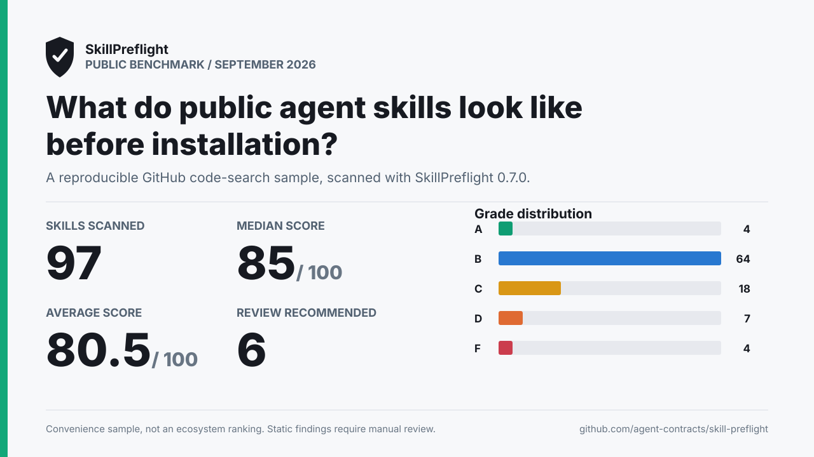

# Public Agent Skill Benchmark: September 2026



This snapshot applies SkillPreflight 0.7.0 to 100 public agent skills discovered through GitHub code search. It is a transparent convenience sample, not a ranking or a claim about the wider ecosystem.

## Results

| Metric | Result |
| --- | ---: |
| Successfully scanned | 97/100 |
| Average score | 80.5/100 |
| Median score | 85/100 |
| Score range | 40-93 |
| High-risk review recommended | 6 |
| Median activation tokens | 844 |
| 90th percentile activation tokens | 4179 |

## Grade Distribution

| Grade | Skills |
| --- | ---: |
| A | 4 |
| B | 64 |
| C | 18 |
| D | 7 |
| F | 4 |

## Category Averages

| Category | Average | Percent of category maximum |
| --- | ---: | ---: |
| Security | 32.4/35 | 92.6% |
| Permission restraint | 14.7/15 | 98% |
| Token efficiency | 12.3/15 | 82% |
| Lightweight footprint | 9.8/10 | 98% |
| Maintainability | 3.7/10 | 37% |
| Reliability | 3/10 | 30% |
| Compatibility | 4.6/5 | 92% |

## Most Common Static Findings

| Rule | Severity | Skills affected | Occurrences |
| --- | --- | ---: | ---: |
| `maintainability.missing-license` | medium | 97 | 97 |
| `reliability.missing-tests` | medium | 97 | 97 |
| `reliability.missing-examples` | low | 93 | 93 |
| `maintainability.missing-readme` | medium | 85 | 85 |
| `maintainability.missing-frontmatter` | low | 32 | 32 |
| `token.no-progressive-disclosure` | medium | 22 | 22 |
| `security.secret-access` | high | 13 | 133 |
| `compatibility.hardcoded-user-path` | medium | 13 | 16 |
| `token.skill-md-huge` | high | 11 | 11 |
| `token.skill-md-large` | medium | 7 | 7 |

## Methodology

- Discovery queries: `SKILL.md path:.claude/skills` and `SKILL.md path:skills`.
- The first eligible results from each query were selected after filtering to public, non-fork repositories and one skill per repository.
- Every GitHub blob URL is pinned to the commit returned by code search. The sample was frozen at 2026-09-01T08:55:10.225Z.
- Scans were generated on 2026-09-01 with SkillPreflight 0.7.0 and its default rules.
- Aggregate metrics include only successfully scanned skill directories. Failed source retrievals are retained with their errors in the raw results.
- The report presents aggregate results. Raw records are retained for reproducibility, not for naming and shaming.

## Reproduce

From the repository root with Node.js 20+, Git, GitHub CLI, and an authenticated `gh` session:

```bash
npm ci
npm run benchmark:public -- --snapshot 2026-09-public-skills
```

The committed `sample.json` is reused by default. To discover and freeze a new sample:

```bash
npm run benchmark:public -- --snapshot YYYY-MM-public-skills --per-query 50 --refresh
```

To regenerate the aggregate files and chart from the existing raw scan records without making network requests:

```bash
npm run benchmark:public -- --snapshot 2026-09-public-skills --reuse-results
```

## Data

- [Frozen source sample](./sample.json)
- [Raw JSON results](./results.json)
- [CSV results](./results.csv)

## Important Limitations

SkillPreflight is static, heuristic pre-install analysis. A high score does not prove that a skill is safe, and a low score does not prove malicious intent. Findings can require context and manual review. GitHub code search ordering introduces selection bias, the sample is small, and repository contents outside each selected skill directory are intentionally excluded.
